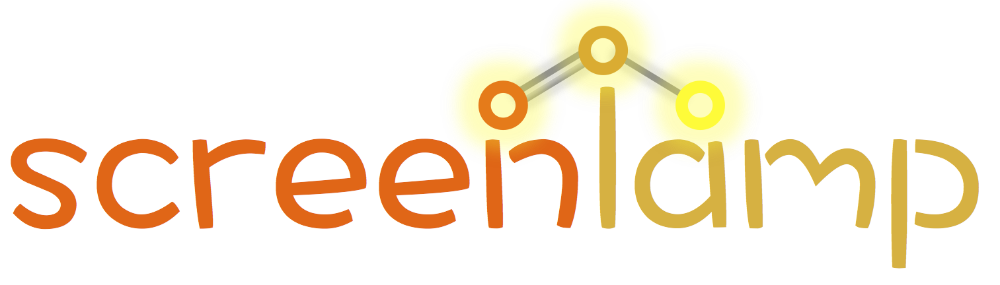

 
 

### A toolkit for ligand-based virtual screening

Screenlamp is a Python package for facilitating ligand-based virtual screening workflows and toolkits with hypothesis-driven filtering steps.

## About

The screenlamp toolkit was developed in the [Protein Structure Analysis & Design Laboratory](http://www.kuhnlab.bmb.msu.edu) at Michigan State University. For additional information on the theory behind the screenlamp project, please refer to the accompanying research publication:

- Raschka, Sebastian, Anne M. Scott, Nan Liu, Santosh Gunturu, Mar Huertas, Weiming Li, and Leslie A. Kuhn (2017). "Enabling the hypothesis-driven prioritization of small molecules in large databases: Screenlamp and its application to GPCR inhibitor discovery" [*Journal*] . [Publisher]: [DOI].

Screenlamp is research software and has been made available to other researchers under a permissive [Apache v2 open source license](license). If you use screenlamp in your scientific projects or any derivative work, the authors of the screenlamp software must be acknowledged and the publication listed above should be cited.

