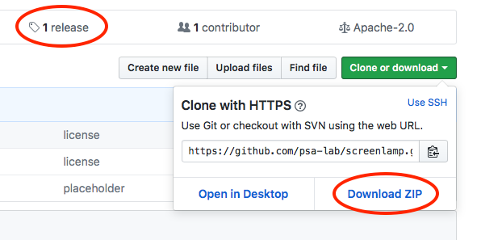
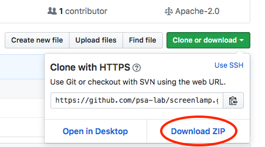

# Installing screenlamp

---

## Obtaining screenlamp

You can download the latest version of screenlamp from the [GitHub repository](https://github.com/psa-lab/screenlamp) by clicking on "Download ZIP" or download the latest stable release from the ["release" list](https://github.com/psa-lab/screenlamp/releases):

## Setting up your Python environment for screenlamp

Python package dependencies of screenlamp are listed in the `requirements.txt` file located in the screenlamp directory. To install all of these dependencies most conveniently, you can execute the following command:

    pip install -r requirements.txt

The the main modules of screenlamp are located in the `tools/` subdirectory, and after satisfying the Python package requirements (see [`requirements.txt`](https://github.com/rasbt/screenlamp/blob/master/requirements.txt)), they are ready to use. If you haven't used screenlamp before, it is recommended that to read the screenlamp [tutorial](user_guide/doc-overview.md).

## Other software requirements

Certain submodules within screenlamp require external software to sample low-energy conformations of molecules and to generate pair-wise overlays. The tools that are currently being used in the [pre-built, automated screening pipeline](user_guide/pipeline-tutorial-1/) are [OpenEye OMEGA](https://www.eyesopen.com/omega) and [OpenEye ROCS](https://www.eyesopen.com/rocs) to accomplish those tasks. However, screenlamp does not strictly require OMEGA and ROCS, and you are free to use any open source alternative that provided that the output files are compatible with screenlamp tools, which uses the MOL2 file format.

If you don't have access to OpenEye toolkits, yet, you can visit the [OpenEye website](https://www.eyesopen.com/licensing-philosophy) for more details on their licensing terms (for example, OpenEye offers a free licensing model for academics engaged in public domain research or teaching).

## Obtaining older versions of screenlamp

To obtain one of the previous versions of screenlamp, please see the [Release Notes](changelog), which contains download links for all release versions of screenlamp.

### Development version

You can download the latest development version of screenlamp as [ZIP](https://github.com/rasbt/screenlamp/archive/master.zip) file directly from GitHub:

 

Alternatively, you can clone the screenlamp development version to your local machine by executing the following command:

    git clone https://github.com/rasbt/screenlamp.git
