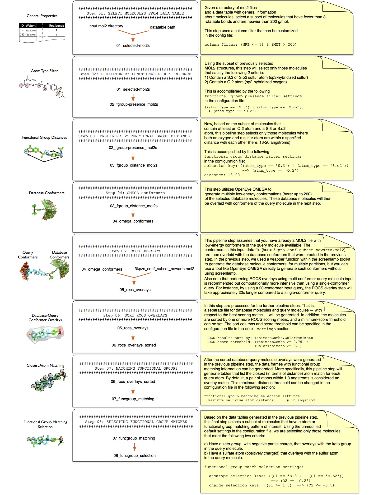

# Automated Pipeline Tutorial

## Overview

This tutorial explains how to use a pre-built screenlamp pipeline to perform an automated virtual screening on a small example dataset.

In this particular screening pipeline, we are searching for mimics of a query molecule that contain a keto- group and sulfur atom in a specified distance to each other (13-20 angstroms) and have a high overall chemical and volumetric similarity towards the query. 

(../images/automated-pipeline-flowchart.png)



(A higher-resolution PDF version is available [here]().)

### Requirements

Before you continue with tutorial, please see the [setup instructions](../installation/index.html#other-software-requirements) for screenlamp if this is your first screening run.


## Obtaining and Preparing the Dataset


### MOL2 Input Files

The automated screenlamp pipeline that is being used in this tutorial is compatible with Tripos MOL2 files of arbitrary database origin and size. A typical use case for this pipeline would be the screening of all ~18,000,000 *Drug-Like* molecules from [ZINC](http://zinc.docking.org), which is available in MOL2 format on ZINC [here](http://zinc.docking.org/subsets/drug-like). Please note that screenlamp supports both Tripos MOL2 (`*.mol2`) files and gzipped Tripos MOL2 files (`*.mol2.gz`) out of the box. Thus, if your input dataset is in gzipped format, you can use it right away without having to make any adjustments or decompressing it. However, please not that the decompressing and compressing operations that are performed when working with gzipped files have an additional toll on computational performance.

**Please keep in mind that this screening pipeline with 18,000,000 input molecules and the pre-configured settings takes about a day to complete on a multi-core desktop computer**. Thus, it is recommended to work through this tutorial using a smaller dataset. With kind permission from John Irwin and the ZINC team, we recommend using a random subset of 70,000 small molecules that we prepared for this tutorial. It takes approximately 10 minutes for a multi-core Desktop computer to execute all steps in the automated, virtual screening pipeline described earlier. This subset from ZINC is split into 7 multi-MOL2 file with 10,000 molecules each: `partition_mol2_1.mol2` to `partition_mol2_7.mol2`. 

For this tutorial, please download the dataset by clicking the following link and unzip it on your machine that you are using for the virtual screening run: [https://s3-us-west-2.amazonaws.com/screenlamp-datasets/pipeline-tutorial_1/partition_1-7.zip](https://s3-us-west-2.amazonaws.com/screenlamp-datasets/pipeline-tutorial_1/partition_1-7.zip)

### Datatable for Prefiltering

For this particular tutorial you'll also need a datatable containing general information about these molecules. Although the partitions you downloaded above are only a small, modified subset of [ZINC](http://zinc.docking.org) molecules, we are going to use the full ~18,000,000 molecule Drug-like table available for download at [http://zinc.docking.org/subsets/drug-like](http://zinc.docking.org/subsets/drug-like). To download the tab-separated table, click on the [Properties](http://zinc.docking.org/db/bysubset/3/3_prop.xls) link on the [ZINC Drug-like](http://zinc.docking.org/subsets/drug-like) page. Please note that the size of the datatable is about ~1.8 Gb, and thus, the download may take a while depending on your internet connection. Alternatively, a smaller datatable containing only ~170,000 molecules, please use the following link: [https://s3-us-west-2.amazonaws.com/screenlamp-datasets/pipeline-tutorial_1/small_table_p1-7.txt](https://s3-us-west-2.amazonaws.com/screenlamp-datasets/pipeline-tutorial_1/small_table_p1-7.txt)


### Query Molecule

The third datafile you'll need for ligand-based virtual screening is the query molecule. For this tutorial, please download the following multi-conformer MOL2 file: [https://s3-us-west-2.amazonaws.com/screenlamp-datasets/pipeline-tutorial_1/3kpzs_query.mol2](https://s3-us-west-2.amazonaws.com/screenlamp-datasets/pipeline-tutorial_1/3kpzs_query.mol2)

## Editing the Configuration File

Once you obtained the database molecules (mol2 partitions), the datatable of molecular properties, and the query molecule, you can prepare the configuration file that stores the information about your local file paths and screening settings.

As your configuration file template, you can use the following YAML file the [`screenlamp/tools/pipelines/pipeline-example-1-config.yaml`](https://github.com/rasbt/screenlamp/blob/master/tools/pipelines/pipeline-example-1-config.yaml), create a local copy of it, and modify the file paths according to your system's configuration.

## Running the Automated Screening Pipeline

After you customized your configuration file, you start the screening pipeline as shown in the example command snippet below:

```bash
python path/to/screenlamp/tools/pipelines/pipeline-example-1.py --config_file /path/to/your/config/pipeline-example-1-config.yaml --incremental true
```

By setting `--incremental true`, you will be prompted to confirm each step by pressing enter, which is recommended for the first time use.

For your reference, a zip archive of all files being generated via the execution of the screenlamp pipeline can be obtained via the following download link: [https://s3-us-west-2.amazonaws.com/screenlamp-datasets/pipeline-tutorial_1/pipeline-tutorial_1_outputs.zip](https://s3-us-west-2.amazonaws.com/screenlamp-datasets/pipeline-tutorial_1/pipeline-tutorial_1_outputs.zip).

## Canceling and Resuming a Screening Run

Note that throughout the screening pipeline execution, you will see a short description of the commands being executed. Also, the current pipeline step being executed will be shown in the terminal window. In case you cancel the or abort a screening run, you can resume it at the last step being executed using the `--start_at_step` flag. For example, if you quit the screening run at Step 2 by pressing CTRL+C

```
################################################
Step 02: PREFILTER BY FUNCTIONAL GROUP PRESENCE
################################################
    
Running command:
python /Users/sebastian/code/screenlamp/tools/funcgroup_presence_to_id.py --input /Users/sebastian/Desktop/screenlamp_pipe/01_selected-mol2s --output /Users/sebastian/Desktop/screenlamp_pipe/02_3keto-and-sulfur-mol2ids.txt --selection ((atom_type == 'S.3') | (atom_type == 'S.o2')) --> (atom_type == 'O.2') --processes 0

Press Enter to proceed or CTRL+C to quit
```

you can resume the run by using `--start_at_step 2` as shown in the example below:

```bash
python path/to/screenlamp/tools/pipelines/pipeline-example-1.py --config_file /path/to/your/config/pipeline-example-1-config.yaml --incremental true --start_at_step 2
```


